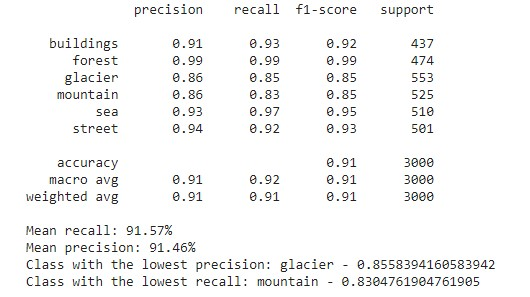
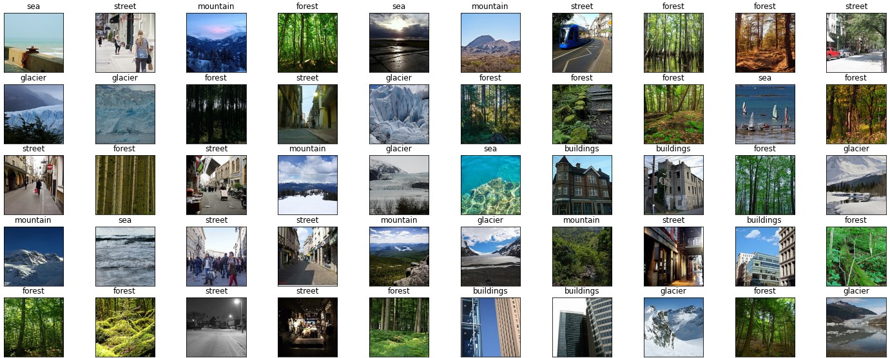
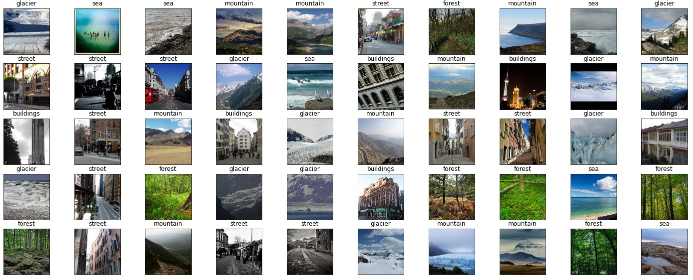
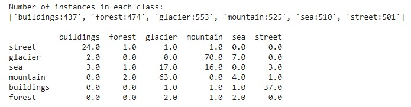

# Kaggle-Challenge_Intel-Image-Classification
## Image Scene Classification of Multiclass

Data Description

The dataset consists of approximately 25k images of size 150*150 from a wide range of natural scenes. They are labelled in one of the following 6 categories: Buildings, forest, glacier, mountain, sea, street. The “Train”, “Test” and “Prediction” data are separated into zip files. There are around 14k images in the “Train”, 3k in the “Test” and 7k in the “Prediction” sets.

Objective

The task is to create a classifier that identifies which kind of scene the image can be categorized into.

Evaluation Metrics

The evaluation metric is accuracy.

Solution Approach

I have set aside 20% of the “Train” set for validation. After quite some experimentation with various augmentation techniques, I concluded that for this dataset, applying a more comprehensive data augmentation does not improve the accuracy of the model. I have resized the images, randomly horizontally flipped them and center-cropped them. 

I did experimentation with various input image sizes(150 pixels or 224 pixels), optimizers (SGD, Adam), batch sizes(64,128,256), and pretrained model architectures (resnet50, resnext50_32x4d, wide_resnet_50_2, shufflenet_v2_x1_0). For the training schedule, I used Leslie Smith’s One Cycle Learning Rate Policy with 50 epochs. I used the Cross_Entropy loss function. I saved the best model based on a decrease in the validation loss and an increase in the validation accuracy.
The highest accuracy that I got was 91% with the following combination of parameters: input image size of 224, batch size of 256, Adam optimizer, a maximum learning rate of 0.001, and the pretrained Resnet50 architecture. 

Results

Classification report

 
Confusion matrix

<image src="assets/confusion_matrix.jpg" width="500">

Misclassified scenes
 
Here is a scene prediction of 100 images.

 

 

We can observe that even to human eyes, differentiating some images is not easy, e.g. glaciers. The classifier makes mistakes in distinguishing snowy mountains and seas from glaciers. Another issue is that some pictures have both buildings and streets within, but the label shows only one. Overall, the model classifies forests well.

Run 

Download the dataset from https://www.kaggle.com/puneet6060/intel-image-classification to your Google Drive.

You may change the image input size, batch size, pretrained model architecture, optimizer, and the number of epochs in the “Set the training parameters” section.

The notebook will generate a CSV file for the history of test loss, validation loss, and validation accuracy.

The notebook creates a confusion matrix, a classification report and a table of confusing categories.

The notebook performs classification on the “Prediction” data and performs visualization on a subset (100 images) of its prediction.

